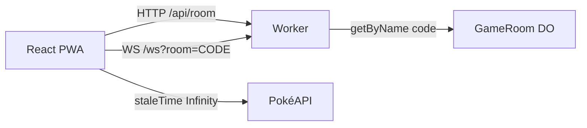

A lot of WebSocket tutorials stop at a chat where the server only sends back the same message it received. I wanted shared state, turns, and reconnect. The result is a Top Trumps-style game over HP, Attack, Defense, Sp. Atk, Sp. Def, and Speed, playable in the browser and installable as a PWA.

Demo: [pokemon-ws-game.satinp-dev.workers.dev](https://pokemon-ws-game.satinp-dev.workers.dev). Source: [`pedrosatin/pokemon-ws-game`](https://github.com/pedrosatin/pokemon-ws-game). Fan/educational project using [PokéAPI](https://pokeapi.co/). No affiliation with Nintendo, Game Freak, Creatures, or The Pokémon Company.

## What the game forces on the protocol

In a turn-based match the server validates each move. The client sends a stat key (`attack`, `speed`, …), never the numeric value. If the phone reloads mid-round, state has to come back. Sprites and names stay off the WebSocket: the socket carries IDs, and the client loads the rest with TanStack Query.

The [Ably WebSockets with React tutorial](https://ably.com/blog/websockets-react-tutorial) covers the client side well (hooks, reconnect). Here the server runs on Cloudflare: one Durable Object per room, with WebSocket hibernation on the Free plan.

## Rules

Two players join with a six-character code. Each gets five Generation 1 IDs. On your turn you pick one attribute from the top card. The Worker compares base stats from a local seed and awards a point. Ties score nothing. After five rounds, higher score wins. With no pick in 15 seconds, the server uses the card's highest stat.

The ruleset is small on purpose. A 3v3 with a type chart pulls the project toward a battle simulator and away from the point: keep socket traffic short.

## Architecture



UI and Worker deploy together with `@cloudflare/vite-plugin`. `/api/*` and `/ws` hit the Worker. The rest of the SPA is static assets.

Each room is `env.GAME_ROOM.getByName(code)`. The code on screen is the Durable Object name, so there is no extra mapping table just to find the instance.

## Socket events

Shared envelope between client and Worker:

```ts
type Envelope<T, P> = {
  v: 1
  type: T
  ts: number
  roomId: string
  seq?: number
  payload: P
}
```

From the client: `JOIN_ROOM`, `READY`, `SELECT_STAT`, `REQUEST_SYNC`, `LEAVE`, `REMATCH`.

From the server: `ROOM_STATE`, `DEAL`, `ROUND_START`, `STAT_SELECTED`, `ROUND_RESULT`, `MATCH_COMPLETED`, `ERROR`.

`DEAL` and `ROUND_START` carry IDs. Art and names stay on the client.

## TanStack Query

Species data does not change. The client sets `staleTime: Infinity` and prefetches the pile when `DEAL` arrives:

```ts
for (const id of deck) {
  void queryClient.prefetchQuery({
    queryKey: ['pokemon', id],
    queryFn: () => fetchPokemon(id),
    staleTime: Infinity,
  })
}
```

If PokéAPI fails, the client uses the same Gen 1 seed the Worker uses to score and builds the artwork URL from the ID. A 429 from the API should not cancel the match.

## Reconnect

`clientId` lives in `sessionStorage`. When the connection drops, the client opens another WebSocket, sends `JOIN_ROOM` with the same id, then `REQUEST_SYNC`. The Durable Object replies with `ROOM_STATE`, `DEAL`, and the current `ROUND_START`.

If a player disappears mid-match, the server waits 60 seconds before a forfeit. A single `setAlarm` covers turn timeout, inter-round delay, and that wait window. Durable Objects only allow one alarm at a time; folding those deadlines into one was the fiddly part.

## Analytics on Free

Each event is one JSON line with `type: "analytics"`. Names I use: `ws_connected`, `ws_disconnected`, `reconnect_recovered`, `match_started`, `round_started`, `stat_selected`, `round_resolved`, `match_completed`. On the Free plan they show up in `wrangler tail`. Enough to check the funnel without a dashboard.

## Run it

```bash
git clone https://github.com/pedrosatin/pokemon-ws-game
cd pokemon-ws-game
pnpm install
pnpm dev
```

Open two tabs, or a phone on the same network. Create a room, share the code, ready up. `pnpm test` covers stat comparison and dealing. `pnpm build` produces the PWA and the Worker.

[Demo](https://pokemon-ws-game.satinp-dev.workers.dev) · [repository](https://github.com/pedrosatin/pokemon-ws-game)
