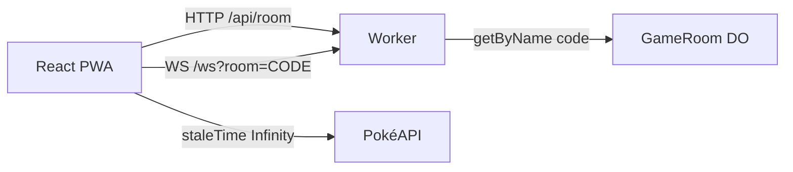

Issue [#37](https://github.com/pedrosatin/satinp-portfolio/issues/37) asked for a write-up about WebSockets with a chat or a simple game. I shipped a Top Trumps-style game over canonical stats (HP, Attack, Defense, Sp. Atk, Sp. Def, Speed), playable in the browser and installable as a PWA.

Live demo: [pokemon-ws-game.satinp-dev.workers.dev](https://pokemon-ws-game.satinp-dev.workers.dev). Source: [`pedrosatin/pokemon-ws-game`](https://github.com/pedrosatin/pokemon-ws-game). It is a fan/educational project: data from [PokéAPI](https://pokeapi.co/), no affiliation with Nintendo, Game Freak, Creatures, or The Pokémon Company.

## Why a game

A chat covers presence and broadcast. A turn-based game adds three constraints:

1. Authoritative server state (the client sends a stat key, never the numeric value).
2. Reconnect that restores the active round.
3. Thin wire payloads, because sprites and names belong elsewhere.

The Ably tutorial linked from #37 covers React hooks, presence, and reconnect. Here each room is a Durable Object with WebSocket hibernation on the Free plan.

## Minimal rules

Two players join with a six-character code. Each gets five Generation 1 IDs. On each round the turn owner picks one stat from the active card. The server compares base stats from a local seed and awards a point. Ties score nothing. After five rounds, higher score wins. A 15-second timeout auto-picks the card's highest stat.

## Architecture



UI and Worker deploy together through `@cloudflare/vite-plugin` (Workers + static assets). `/api/*` and `/ws` hit the Worker first. The rest of the SPA is static assets.

Each room is `env.GAME_ROOM.getByName(code)`. The displayed code is the Durable Object name.

## Event contract

Shared envelope:

```ts
type Envelope<T, P> = {
  v: 1
  type: T
  ts: number
  roomId: string
  seq?: number
  payload: P
}
```

Client sends `JOIN_ROOM`, `READY`, `SELECT_STAT`, `REQUEST_SYNC`, `LEAVE`, `REMATCH`.

Server sends `ROOM_STATE`, `DEAL`, `ROUND_START`, `STAT_SELECTED`, `ROUND_RESULT`, `MATCH_COMPLETED`, `ERROR`.

`DEAL` and `ROUND_START` carry IDs only. Sprites and names stay off the socket.

## TanStack Query

Species data is immutable. The client sets `staleTime: Infinity` and prefetches the dealt pile when `DEAL` arrives:

```ts
for (const id of deck) {
  void queryClient.prefetchQuery({
    queryKey: ['pokemon', id],
    queryFn: () => fetchPokemon(id),
    staleTime: Infinity,
  })
}
```

If PokéAPI is down, the client falls back to the same Gen 1 seed the Worker uses to score rounds, and builds the official artwork URL from the ID.

## Reconnect

`clientId` lives in `sessionStorage`. After a drop, the client opens a new socket, sends `JOIN_ROOM` with the same `clientId`, then `REQUEST_SYNC`. The Durable Object replies with `ROOM_STATE`, `DEAL`, and the current `ROUND_START`.

If a player disappears mid-match, the server waits 60 seconds before a forfeit. A single `setAlarm` multiplexes turn timeout, inter-round delay, and reconnect grace.

## Analytics

The Worker logs one JSON line per event with `type: "analytics"`. Funnel names:

- `ws_connected` / `ws_disconnected`
- `reconnect_recovered`
- `match_started` / `round_started` / `stat_selected` / `round_resolved` / `match_completed`

On the Free plan those lines show up in `wrangler tail` and Worker observability.

## Honest limits

The Gen 1 seed in the Worker keeps scoring offline from PokéAPI. The client still uses PokéAPI for sprites. The PWA caches the shell; matches need a network. The public title prefers "stats Top Trumps" over "Pokémon battle".

A type-chart 3v3 would drift toward a reduced Showdown and dilute the article thesis (thin WS + Query for static data).

## Run it

```bash
git clone https://github.com/pedrosatin/pokemon-ws-game
cd pokemon-ws-game
pnpm install
pnpm dev
```

Open two tabs (or a phone on the same network), create a room, share the code, ready up, and play. `pnpm test` covers stat comparison and dealing. `pnpm build` produces the PWA SPA and the Worker.

Links: [demo](https://pokemon-ws-game.satinp-dev.workers.dev), [repository](https://github.com/pedrosatin/pokemon-ws-game), [issue #37](https://github.com/pedrosatin/satinp-portfolio/issues/37).
