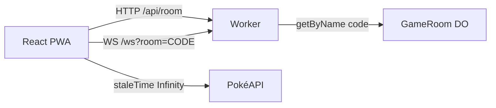

[Issue #37](https://github.com/pedrosatin/satinp-portfolio/issues/37) asked for a write-up on WebSockets. Chat or a simple game. I went with a game: Top Trumps over HP, Attack, Defense, Sp. Atk, Sp. Def, and Speed.

Demo: [pokemon-ws-game.satinp-dev.workers.dev](https://pokemon-ws-game.satinp-dev.workers.dev). Source: [`pedrosatin/pokemon-ws-game`](https://github.com/pedrosatin/pokemon-ws-game). Fan/educational. Data from [PokéAPI](https://pokeapi.co/). No affiliation with Nintendo, Game Freak, Creatures, or The Pokémon Company.

## Why a game

A chat covers presence and broadcast. Turn-based play needs more. The server has to own the truth: the client sends a stat key, never the number. A round has to survive a phone refresh. And the socket does not need sprites or names; those belong elsewhere.

The Ably tutorial linked from #37 is solid for React hooks and reconnect. I wanted the server on the edge: one Durable Object per room, with WebSocket hibernation on the Free plan.

## The rules

Two players join with a six-character code. Each gets five Generation 1 IDs. On your turn you pick one stat from the top card. The Worker compares base stats from a local seed and awards a point. Ties score nothing. After five rounds, higher score wins. If nobody picks within 15 seconds, the server auto-picks the card's highest stat.

I picked this ruleset because it fits in a blog post. A type-chart 3v3 drifts into Showdown-lite and buries the point: keep the wire thin.

## Layout



UI and Worker ship together with `@cloudflare/vite-plugin`. `/api/*` and `/ws` hit the Worker first. The rest of the SPA is static assets.

A room is `env.GAME_ROOM.getByName(code)`. The code on screen is the Durable Object name, so there is no extra mapping table just to find the instance.

## What goes on the socket

Shared envelope:

```ts
type Envelope<T, P> = {
  v: 1
  type: T
  ts: number
  roomId: string
  seq?: number
  payload: P
}
```

From the client: `JOIN_ROOM`, `READY`, `SELECT_STAT`, `REQUEST_SYNC`, `LEAVE`, `REMATCH`.

From the server: `ROOM_STATE`, `DEAL`, `ROUND_START`, `STAT_SELECTED`, `ROUND_RESULT`, `MATCH_COMPLETED`, `ERROR`.

`DEAL` and `ROUND_START` carry IDs. Art and names stay off the wire.

## Query on one side, socket on the other

Species data does not change. The client sets `staleTime: Infinity` and prefetches the pile on `DEAL`:

```ts
for (const id of deck) {
  void queryClient.prefetchQuery({
    queryKey: ['pokemon', id],
    queryFn: () => fetchPokemon(id),
    staleTime: Infinity,
  })
}
```

If PokéAPI is down, the client falls back to the same Gen 1 seed the Worker uses to score, and builds the artwork URL from the ID. I did not want a 429 to cancel the match.

## When the tab disappears

`clientId` lives in `sessionStorage`. After a drop, the client opens a new socket, sends `JOIN_ROOM` with the same id, then `REQUEST_SYNC`. The Durable Object replies with `ROOM_STATE`, `DEAL`, and the current `ROUND_START`.

If a player vanishes mid-match, the server waits 60 seconds before a forfeit. One `setAlarm` handles turn timeout, inter-round delay, and that grace window. Durable Objects only get one alarm at a time, so multiplexing that was the annoying part.

## Logs instead of PostHog

Each event is one JSON line with `type: "analytics"`: `ws_connected`, `ws_disconnected`, `reconnect_recovered`, `match_started`, `round_started`, `stat_selected`, `round_resolved`, `match_completed`. On Free they show up in `wrangler tail`. Enough to check the funnel without a dashboard.

## Run it locally

```bash
git clone https://github.com/pedrosatin/pokemon-ws-game
cd pokemon-ws-game
pnpm install
pnpm dev
```

Two tabs, or a phone on the same network. Create a room, share the code, ready up. `pnpm test` covers stat comparison and dealing. `pnpm build` produces the PWA and the Worker.

[Demo](https://pokemon-ws-game.satinp-dev.workers.dev) · [repo](https://github.com/pedrosatin/pokemon-ws-game) · [#37](https://github.com/pedrosatin/satinp-portfolio/issues/37)
