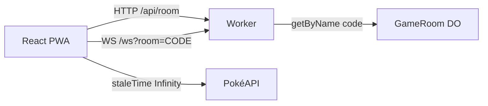

A [issue #37](https://github.com/pedrosatin/satinp-portfolio/issues/37) pediu um texto sobre WebSockets. Chat ou jogo simples. Eu fui de jogo: Super Trunfo com HP, Attack, Defense, Sp. Atk, Sp. Def e Speed.

Demo: [pokemon-ws-game.satinp-dev.workers.dev](https://pokemon-ws-game.satinp-dev.workers.dev). Código: [`pedrosatin/pokemon-ws-game`](https://github.com/pedrosatin/pokemon-ws-game). É fan/educacional. Dados da [PokéAPI](https://pokeapi.co/). Sem afiliação à Nintendo, Game Freak, Creatures ou The Pokémon Company.

## Por que jogo e não chat

Chat cobre presence e broadcast. Partida por turnos exige mais. O servidor precisa ser a fonte da verdade: o cliente manda só a chave do stat, nunca o número. A rodada tem de sobreviver a um refresh no celular. E o WebSocket não precisa carregar sprite nem nome, porque isso já vem de outra camada.

O tutorial da Ably linkado na #37 ajuda com hooks React e reconnect. Eu quis o servidor na edge: um Durable Object por sala, com hibernação de WebSocket no plano Free.

## Como se joga

Dois jogadores entram com um código de seis caracteres. Cada um ganha cinco IDs da geração 1. No seu turno você escolhe um atributo da carta do topo. O Worker compara os base stats de um seed local e marca um ponto. Empate não pontua. Depois de cinco rodadas, maior placar vence. Se ninguém escolher em 15 segundos, o servidor pega o maior stat da carta sozinho.

Escolhi essa mecânica porque a superfície de regras cabe num post. Um 3v3 com tabela de tipos vira Showdown enxuto e some com a tese: payload magro no fio.

## O desenho



UI e Worker sobem juntos com `@cloudflare/vite-plugin`. `/api/*` e `/ws` batem no Worker primeiro. O resto da SPA fica em assets estáticos.

A sala é `env.GAME_ROOM.getByName(code)`. O código na tela é o nome do Durable Object. Isso evita uma tabela de mapeamento só para achar a instância certa.

## O que passa no socket

Envelope compartilhado:

```ts
type Envelope<T, P> = {
  v: 1
  type: T
  ts: number
  roomId: string
  seq?: number
  payload: P
}
```

Do client: `JOIN_ROOM`, `READY`, `SELECT_STAT`, `REQUEST_SYNC`, `LEAVE`, `REMATCH`.

Do server: `ROOM_STATE`, `DEAL`, `ROUND_START`, `STAT_SELECTED`, `ROUND_RESULT`, `MATCH_COMPLETED`, `ERROR`.

`DEAL` e `ROUND_START` carregam IDs. Arte e nome ficam fora.

## Query de um lado, socket do outro

Dados de espécie não mudam. O client usa `staleTime: Infinity` e faz prefetch da pilha no `DEAL`:

```ts
for (const id of deck) {
  void queryClient.prefetchQuery({
    queryKey: ['pokemon', id],
    queryFn: () => fetchPokemon(id),
    staleTime: Infinity,
  })
}
```

Se a PokéAPI cair, o client usa o mesmo seed gen 1 que o Worker usa para pontuar e monta a URL da arte a partir do ID. Eu não queria que um 429 na PokéAPI invalidasse a partida.

## Quando a aba some

O `clientId` fica em `sessionStorage`. Caiu a conexão, o client reabre o socket, manda `JOIN_ROOM` com o mesmo id e depois `REQUEST_SYNC`. O Durable Object devolve `ROOM_STATE`, `DEAL` e o `ROUND_START` atual.

Se um jogador some no meio, o servidor espera 60 segundos antes do forfeit. Um único `setAlarm` cuida de timeout de turno, pausa entre rodadas e esse grace. Durable Object só tem um alarm por vez, então multiplexar isso foi a parte chata.

## Logs em vez de PostHog

Cada evento vira uma linha JSON com `type: "analytics"`: `ws_connected`, `ws_disconnected`, `reconnect_recovered`, `match_started`, `round_started`, `stat_selected`, `round_resolved`, `match_completed`. No Free isso aparece no `wrangler tail`. Chega para validar o funil sem montar painel.

## Rodando local

```bash
git clone https://github.com/pedrosatin/pokemon-ws-game
cd pokemon-ws-game
pnpm install
pnpm dev
```

Duas abas, ou um celular na mesma rede. Crie a sala, compartilhe o código, marque pronto. `pnpm test` cobre comparação de stats e o deal. `pnpm build` gera a PWA e o Worker.

[Demo](https://pokemon-ws-game.satinp-dev.workers.dev) · [repo](https://github.com/pedrosatin/pokemon-ws-game) · [#37](https://github.com/pedrosatin/satinp-portfolio/issues/37)
