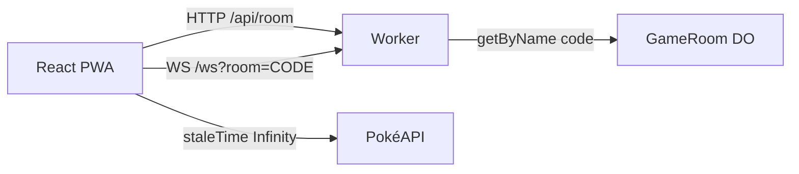

Muitos tutoriais de WebSocket param num chat em que o servidor só devolve a mesma mensagem que recebeu. Eu quis um exemplo com estado compartilhado, turno e reconexão. O resultado é um Super Trunfo com HP, Attack, Defense, Sp. Atk, Sp. Def e Speed, jogável no browser e instalável como PWA.

Demo: [pokemon-ws-game.satinp-dev.workers.dev](https://pokemon-ws-game.satinp-dev.workers.dev). Código: [`pedrosatin/pokemon-ws-game`](https://github.com/pedrosatin/pokemon-ws-game). Projeto fan/educacional com dados da [PokéAPI](https://pokeapi.co/). Sem afiliação à Nintendo, Game Freak, Creatures ou The Pokémon Company.

## O que o jogo força no protocolo

Numa partida por turnos o servidor é quem valida a jogada. O cliente envia a chave do stat (`attack`, `speed`, …), nunca o valor numérico. Se o celular recarregar no meio da rodada, o estado precisa voltar. Sprites e nomes ficam fora do WebSocket: o socket carrega IDs, e o client busca o resto com TanStack Query.

O tutorial da [Ably sobre WebSockets com React](https://ably.com/blog/websockets-react-tutorial) cobre bem o lado do client (hooks, reconnect). Aqui o servidor roda na Cloudflare: um Durable Object por sala, com hibernação de WebSocket no plano Free.

## Regras

Dois jogadores entram com um código de seis caracteres. Cada um recebe cinco IDs da geração 1. No turno, a pessoa escolhe um atributo da carta do topo. O Worker compara os base stats de um seed local e marca um ponto. Empate não pontua. Depois de cinco rodadas, quem tiver mais pontos vence. Sem escolha em 15 segundos, o servidor usa o maior stat da carta.

A mecânica é pequena de propósito. Um combate 3v3 com tabela de tipos puxa o projeto para um simulador e desvia do foco: manter o tráfego do socket curto.

## Arquitetura



A UI e o Worker sobem juntos com `@cloudflare/vite-plugin`. As rotas `/api/*` e `/ws` passam pelo Worker. O restante da SPA fica em assets estáticos.

Cada sala é `env.GAME_ROOM.getByName(code)`. O código mostrado na tela é o nome do Durable Object, então não há uma tabela extra só para achar a instância.

## Eventos no socket

Envelope compartilhado entre client e Worker:

```ts
type Envelope<T, P> = {
  v: 1
  type: T
  ts: number
  roomId: string
  seq?: number
  payload: P
}
```

Do client: `JOIN_ROOM`, `READY`, `SELECT_STAT`, `REQUEST_SYNC`, `LEAVE`, `REMATCH`.

Do server: `ROOM_STATE`, `DEAL`, `ROUND_START`, `STAT_SELECTED`, `ROUND_RESULT`, `MATCH_COMPLETED`, `ERROR`.

Em `DEAL` e `ROUND_START` o payload traz IDs. Arte e nome ficam no client.

## TanStack Query

Os dados de espécie não mudam. O client usa `staleTime: Infinity` e faz prefetch da pilha quando chega o `DEAL`:

```ts
for (const id of deck) {
  void queryClient.prefetchQuery({
    queryKey: ['pokemon', id],
    queryFn: () => fetchPokemon(id),
    staleTime: Infinity,
  })
}
```

Se a PokéAPI falhar, o client usa o mesmo seed gen 1 que o Worker usa para pontuar e monta a URL da arte a partir do ID. Assim um 429 na API não derruba a partida.

## Reconexão

O `clientId` fica em `sessionStorage`. Quando a conexão cai, o client abre outro WebSocket, manda `JOIN_ROOM` com o mesmo id e em seguida `REQUEST_SYNC`. O Durable Object responde com `ROOM_STATE`, `DEAL` e o `ROUND_START` atual.

Se um jogador some no meio da partida, o servidor espera 60 segundos antes de declarar forfeit. Um único `setAlarm` cobre timeout de turno, pausa entre rodadas e esse período de espera. Durable Object só permite um alarm por vez; juntar esses prazos num só foi a parte mais trabalhosa.

## Analytics no Free

Cada evento vira uma linha JSON com `type: "analytics"`. Os nomes que uso: `ws_connected`, `ws_disconnected`, `reconnect_recovered`, `match_started`, `round_started`, `stat_selected`, `round_resolved`, `match_completed`. No plano Free isso aparece no `wrangler tail`. Serve para conferir o funil sem montar um painel.

## Como rodar

```bash
git clone https://github.com/pedrosatin/pokemon-ws-game
cd pokemon-ws-game
pnpm install
pnpm dev
```

Abra duas abas, ou um celular na mesma rede. Crie a sala, compartilhe o código, marque pronto. `pnpm test` cobre comparação de stats e o deal. `pnpm build` gera a PWA e o Worker.

[Demo](https://pokemon-ws-game.satinp-dev.workers.dev) · [repositório](https://github.com/pedrosatin/pokemon-ws-game)
