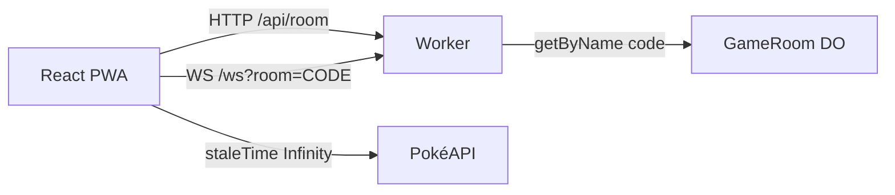

A issue [#37](https://github.com/pedrosatin/satinp-portfolio/issues/37) pedia um texto sobre WebSockets com um chat ou um jogo simples. Eu escolhi um Super Trunfo de atributos canônicos (HP, Attack, Defense, Sp. Atk, Sp. Def, Speed), jogável no navegador e instalável como PWA.

Demo ao vivo: [pokemon-ws-game.satinp-dev.workers.dev](https://pokemon-ws-game.satinp-dev.workers.dev). Código em [`pedrosatin/pokemon-ws-game`](https://github.com/pedrosatin/pokemon-ws-game). O framing é fan/educacional: dados da [PokéAPI](https://pokeapi.co/), sem afiliação à Nintendo, Game Freak, Creatures ou The Pokémon Company.

## Por que um jogo

Um chat mostra presence e broadcast. Um jogo turn-based força três propriedades extras:

1. Estado autoritativo no servidor (o cliente não envia o valor do stat, só a chave escolhida).
2. Reconexão com recuperação de rodada.
3. Payloads curtos no fio, porque sprites e nomes já existem em outra camada.

O tutorial da Ably citado na #37 cobre hooks React, presence e reconnect. Aqui o servidor é um Durable Object por sala, com hibernação de WebSocket no plano Free.

## Regras mínimas

Dois jogadores entram por código de seis caracteres. Cada um recebe cinco IDs da geração 1. Em cada rodada o dono do turno escolhe um stat da carta ativa. O servidor compara os base stats do seed local e soma um ponto. Empate não pontua. Vence quem tiver mais pontos após cinco rodadas. Timeout de 15 segundos escolhe o maior stat da carta.

## Arquitetura



A UI e o Worker sobem juntos via `@cloudflare/vite-plugin` (Workers + static assets). Rotas `/api/*` e `/ws` passam pelo Worker primeiro. O restante da SPA fica em assets estáticos, sem contar no mesmo jeito que um hit de Function.

Cada sala é `env.GAME_ROOM.getByName(code)`. O código exibido é o nome do Durable Object.

## Contrato de eventos

Envelope comum:

```ts
type Envelope<T, P> = {
  v: 1
  type: T
  ts: number
  roomId: string
  seq?: number
  payload: P
}
```

Cliente envia `JOIN_ROOM`, `READY`, `SELECT_STAT`, `REQUEST_SYNC`, `LEAVE`, `REMATCH`.

Servidor responde `ROOM_STATE`, `DEAL`, `ROUND_START`, `STAT_SELECTED`, `ROUND_RESULT`, `MATCH_COMPLETED`, `ERROR`.

No `DEAL` e no `ROUND_START` o payload carrega IDs. Sprites e nomes ficam fora do WebSocket.

## TanStack Query

Os dados de espécie são imutáveis. O client usa `staleTime: Infinity` e faz prefetch da pilha no instante do `DEAL`:

```ts
for (const id of deck) {
  void queryClient.prefetchQuery({
    queryKey: ['pokemon', id],
    queryFn: () => fetchPokemon(id),
    staleTime: Infinity,
  })
}
```

Se a PokéAPI falhar, o client cai no mesmo seed gen 1 que o Worker usa para resolver a rodada, e monta a URL de arte oficial a partir do ID.

## Reconnect

O `clientId` vive em `sessionStorage`. Ao cair a conexão, o client reabre o WebSocket, manda `JOIN_ROOM` com o mesmo `clientId` e em seguida `REQUEST_SYNC`. O Durable Object reenvia `ROOM_STATE`, `DEAL` e o `ROUND_START` atual.

Se um jogador some no meio da partida, o servidor espera 60 segundos antes do forfeit. Um único `setAlarm` multiplexa timeout de turno, pausa entre rodadas e grace de reconnect.

## Analytics

No Worker, cada evento vira uma linha JSON com `type: "analytics"`. Os nomes usados no funil:

- `ws_connected` / `ws_disconnected`
- `reconnect_recovered`
- `match_started` / `round_started` / `stat_selected` / `round_resolved` / `match_completed`

No plano Free isso aparece em `wrangler tail` e na observability do Worker. Serve para o post e para validar o funil sem PostHog.

## Limites honestos

O seed gen 1 no Worker evita depender da PokéAPI na hora de pontuar. A PokéAPI ainda alimenta sprites no client. O PWA cacheia a shell; a partida exige rede. O título público evita "batalha Pokémon" e usa "Super Trunfo de stats".

Um 3v3 com type chart e golpes ficaria próximo de um Showdown reduzido. Aumentaria a superfície de regras sem melhorar a tese do artigo (WS magro + Query para dados estáticos).

## Como rodar

```bash
git clone https://github.com/pedrosatin/pokemon-ws-game
cd pokemon-ws-game
pnpm install
pnpm dev
```

Abra duas abas (ou um celular na mesma rede), crie a sala, compartilhe o código, marque pronto e jogue. `pnpm test` cobre comparação de stats e o deal. `pnpm build` gera a SPA PWA e o Worker.

Links úteis: [demo](https://pokemon-ws-game.satinp-dev.workers.dev), [repositório](https://github.com/pedrosatin/pokemon-ws-game), [issue #37](https://github.com/pedrosatin/satinp-portfolio/issues/37).
